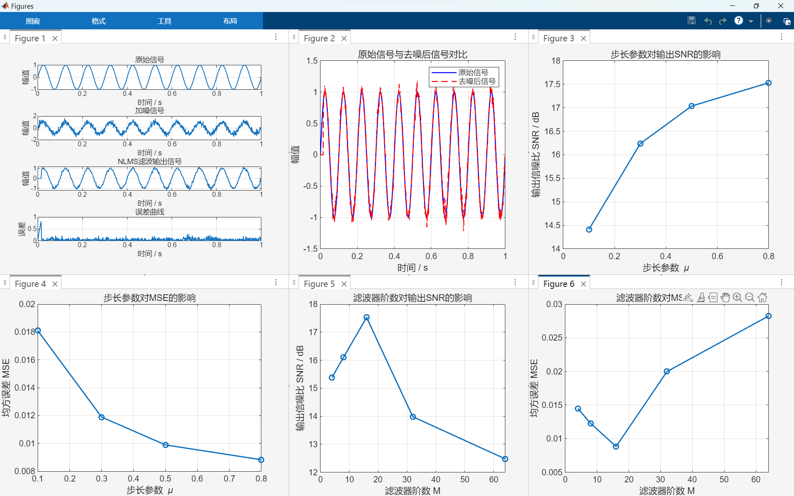
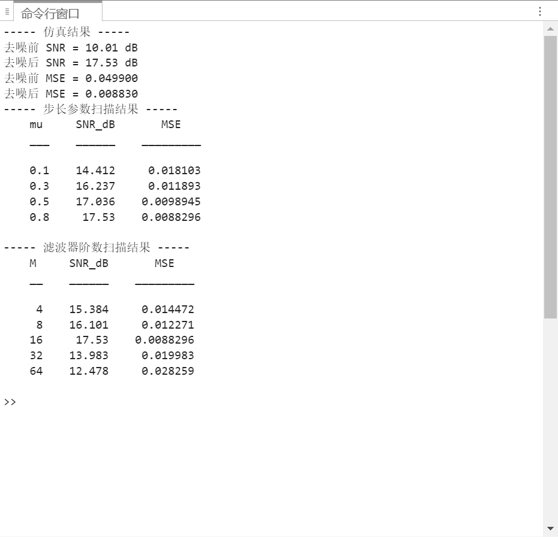

# Adaptive Signal Denoising Based on NLMS Algorithm

This project implements an adaptive signal denoising system using the NLMS (Normalized Least Mean Square) algorithm in MATLAB.

## Project Description

The system simulates noisy signal environments and applies adaptive filtering to suppress noise and recover the original signal.

The main modules include:

- Signal generation
- Noise addition (AWGN)
- NLMS adaptive filtering
- Parameter scanning
- Performance evaluation
- Visualization

## Experimental Results

Input SNR: **10.01 dB**

Output SNR: **17.53 dB**

SNR Improvement: **~7.5 dB**

MSE Reduction:

0.0499 → 0.00883

## Simulation Result

## Parameter Analysis

The influence of step size μ and filter order M on SNR and MSE was analyzed.

## Tools

- MATLAB
- Signal Processing
- Adaptive Filtering
- NLMS Algorithm
